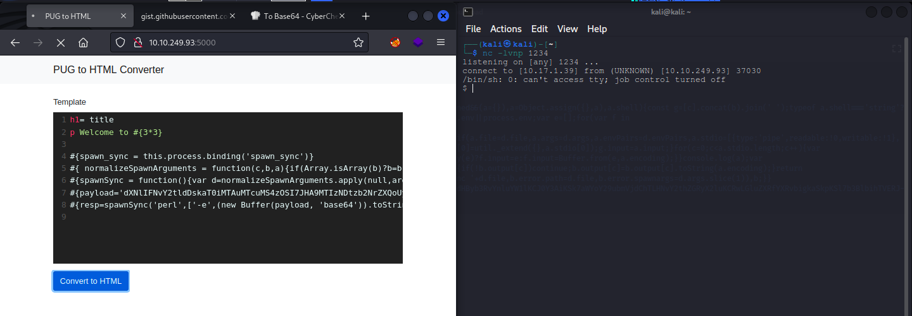

<h1>writeup-templates</h1>

I have created this writeup including the exact steps i took to solve this machine.

  
<blockquote>
    The room description is suggesting us to navigate to port 5000. It's also asking us to try and learn SSTI.
</blockquote>
<ul>
    <li>
        <strong>Step 1 :</strong>
        <ul>
            Check out the web application. 
              
        </ul>
    </li>
    <li>
        <strong>Step 2 :</strong>
        <ul>
            Search for `PUG ssti` on google and found exactly what i needed.
            You can find it <a href="https://gist.github.com/Jasemalsadi/2862619f21453e0a6ba2462f9613b49f">here</a>
        </ul>
    </li>
    <li>
        <strong>Step 3 :</strong>
        <ul>
            Modify the payload.
            <ol>
                <li>Copy the payload to <a href="https://gchq.github.io/CyberChef/">CyberChef</a>.</li>
                <li>Select <code>From base64</code> from Operations and drag it to Recipe.</li>
                <li>Put in your IP and PORT number and encode the payload back to base64.</li>
                <li>Use this base64 as your payload</li>
            </ol>
        </ul>
    </li>
    <li>
        <strong>Step 4 :</strong>
        <ul>
            Start a netcat listener.
        </ul>
    </li>
    <li>
        <strong>Step 5 :</strong>
        <ul>
            Paste the SSTI payload in the template and click <code>Convert to HTML</code> and you will have your reverse shell. 
             
            Just do <code>ls -la</code> and you will get your flag.
        </ul>
    </li>
    <li>
        <strong>Step 6 :</strong>
        <ul>
            For those who want to root the machine can do that by using DirtyPipe exploit. I have included the steps for that 
            in my writeup for epoch which is also available on my github so i will not include that here but you can check it out
            using <a href="https://github.com/vikashkr99/writeup-Epoch">this</a> link here.
        </ul>
    </li>
    <h1>Solved 😁</h1>
</ul>